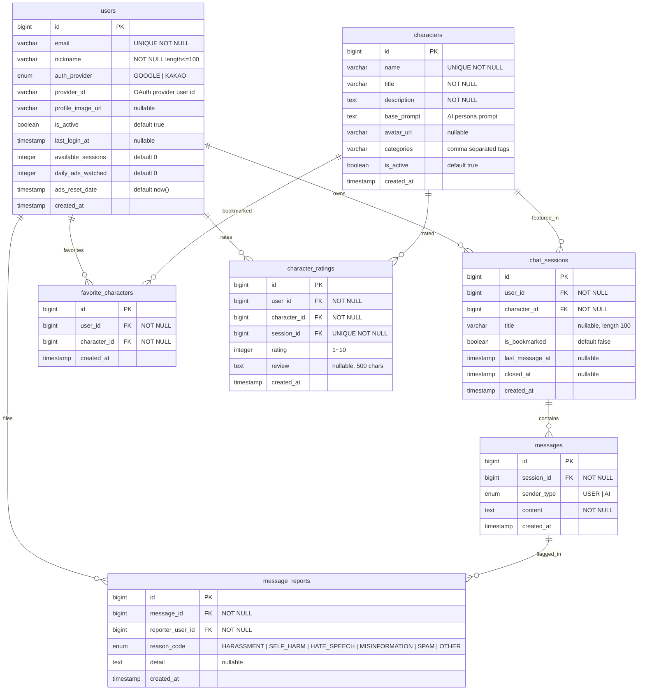

# ERD (Entity Relationship Diagram)

## 데이터베이스 스키마 개요


> Kotlin 도메인과 실제 테이블 모두 `Character` 네이밍을 사용하며, 기존 `counselors` 명칭은 더 이상 존재하지 않습니다.

## 인덱스 전략
```sql
CREATE INDEX idx_users_provider ON users(provider_id, auth_provider);
CREATE INDEX idx_characters_active ON characters(is_active);
CREATE INDEX idx_characters_name ON characters(name);
CREATE INDEX idx_sessions_user ON chat_sessions(user_id, last_message_at DESC);
CREATE INDEX idx_messages_session ON messages(session_id, created_at);
CREATE INDEX idx_favorite_characters_user ON favorite_characters(user_id);
CREATE INDEX idx_character_ratings_character ON character_ratings(character_id);
CREATE INDEX idx_message_reports_message ON message_reports(message_id);
```

## 스키마 관리 메모
- 모든 엔티티는 `BaseEntity`를 상속해 `id`, `created_at`, `updated_at`을 공통 관리합니다.
- 개발/테스트 프로필은 H2 + `ddl-auto=create-drop`으로 매 실행 시 스키마를 재생성합니다.
- 운영 환경은 JPA DDL 생성 후 수동 마이그레이션 스크립트를 적용하며, 구조 변경 시 `ALTER` 스크립트를 별도로 관리합니다.
- `InitDataConfig`는 데이터가 비어 있을 때만 캐릭터/테스트 계정을 시드합니다.

## Redis 키 스키마
- `character:list:{sort}:{page}:{size}`: 캐릭터 목록 캐시 (`PagedResponse`).
- `character:detail:{characterId}`: 캐릭터 상세 캐시.
- `user-sessions:{userId}:b:{bookmarked}:c:{isClosed}:p:{page}:s:{size}`: 세션 목록 캐시 (`CachedPage`).
- `session-messages:{sessionId}:p:{page}:s:{size}`: 세션 메시지 캐시.
- `oauth:google-token:{token}` / `oauth:kakao-token:{token}`: OAuth 검증 결과 캐시 (TTL 60초).
- `refresh-token:{token}` + `refresh-token:user:{userId}`: Refresh 토큰 저장 및 사용자별 토큰 집합.

## 향후 확장
- 메시지 신고 테이블에 처리 상태(`status`), 담당자(`assignee`) 컬럼을 추가해 운영 워크플로를 지원합니다.
- 세션 검색/요약 기능 도입 시 메시지 임베딩 테이블 또는 외부 벡터 스토리지 연동을 검토합니다.
- 캐릭터 추천 로직을 위한 사용자 취향 지표(평균 평점, 즐겨찾기 카테고리) 테이블을 추가할 수 있습니다.
