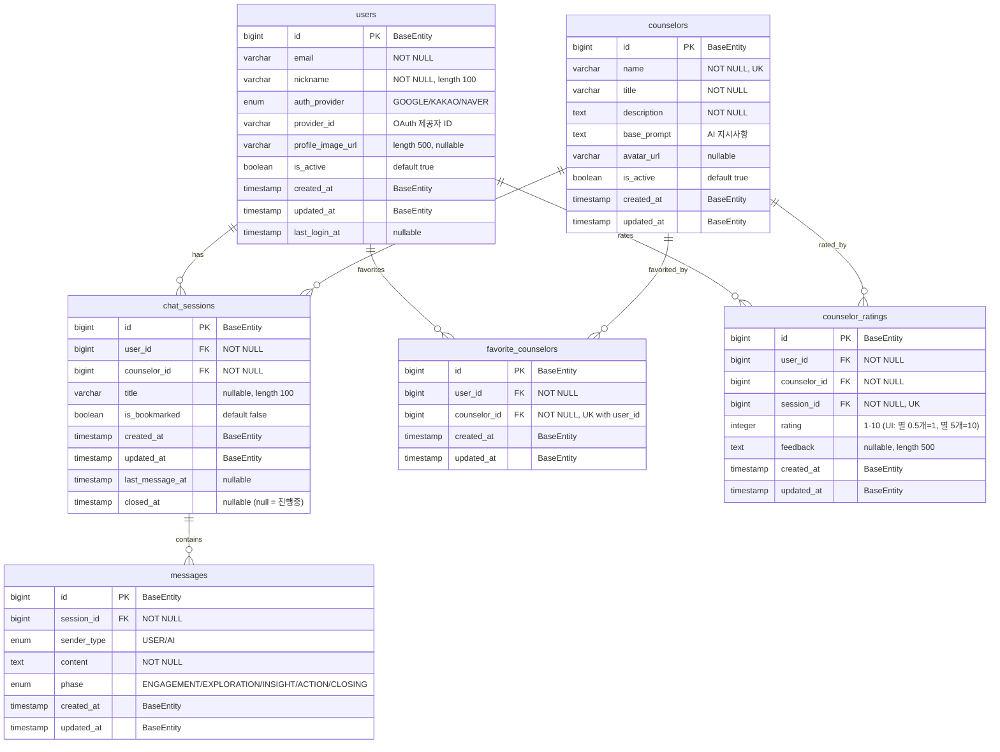

# ERD (Entity Relationship Diagram)

## 데이터베이스 스키마 설계



## 테이블 설명

### 1. users
- 사용자 정보 저장
- `auth_provider`: OAuth 제공자 (Google/Kakao/Naver)
- `provider_id`: OAuth 제공자가 주는 고유 ID
- `profile_image_url`: OAuth에서 가져온 프로필 이미지
- `is_active`: 계정 활성화 상태

### 2. counselors
- 상담사(AI 페르소나) 정보
- `base_prompt`: AI에게 전달할 기본 지시사항 (성격 특성 포함)
  - 상담 스타일, 질문 성향, 공감 수준 등을 텍스트로 포함
  - 현대적 언어 사용, 단계별 상담 진행 지시 포함
- `avatar_url`: 프론트엔드에서 표시할 상담사 프로필 이미지

### 3. chat_sessions
- 사용자와 상담사 간의 대화 세션
- `title`: 세션 제목 (첫 메시지 기반 자동 생성, 사용자 수정 가능)
- `is_bookmarked`: 사용자가 북마크한 세션
- `last_message_at`: 마지막 메시지 시간
- `closed_at`: 세션 종료 시간 (null = 진행중)

### 4. messages
- 개별 메시지 저장
- `sender_type`: 메시지 발신자 (USER/AI)
- `phase`: 메시지가 속한 상담 단계
  - ENGAGEMENT: 관계 형성
  - EXPLORATION: 문제 탐색
  - INSIGHT: 통찰 유도
  - ACTION: 행동 계획
  - CLOSING: 마무리

### 5. favorite_counselors
- 사용자가 즐겨찾기한 상담사
- 빠른 접근을 위한 매핑 테이블

### 6. counselor_ratings
- 세션 종료 후 상담사 평가
- `rating`: 1-10 정수값 (DB 저장)
  - UI 표시: 별점 0.5~5.0 (반개 단위)
  - 변환: DB값 ÷ 2 = 별점, 별점 × 2 = DB값
  - 예: 1=★☆☆☆☆, 5=★★★☆☆, 10=★★★★★
- `feedback`: 피드백 텍스트 (최대 500자)
- 각 세션당 1개의 평가만 가능 (session_id UK)

## 인덱스 전략

```sql
-- 자주 사용되는 조회를 위한 인덱스
CREATE INDEX idx_sessions_user_id ON chat_sessions(user_id);
CREATE INDEX idx_sessions_counselor_id ON chat_sessions(counselor_id);
CREATE INDEX idx_messages_session_id ON messages(session_id);
CREATE INDEX idx_messages_created_at ON messages(created_at);
CREATE INDEX idx_ratings_counselor_id ON counselor_ratings(counselor_id);
```

## 주요 변경사항

1. **OAuth 기반 인증**: Google/Kakao/Naver OAuth만 사용
2. **세션 북마크**: 개별 메시지가 아닌 세션 단위 북마크
3. **세션 요약 제거**: 과도한 기능 제거로 MVP 단순화
4. **사용자 선호도 제거**: preference_matrix 제거, AI 도우미가 추천
5. **심플한 구조**: 핵심 기능만 남기고 단순화
