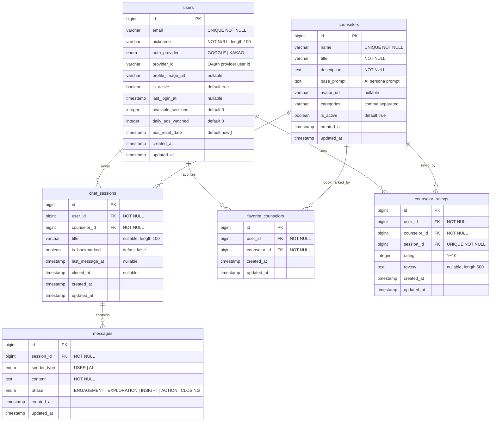

# ERD (Entity Relationship Diagram)

## 데이터베이스 스키마 개요



## 테이블 설명

### users
- OAuth 기반 사용자 계정 정보를 저장한다.
- `auth_provider`는 현재 Google 또는 Kakao만 허용한다.
- `available_sessions`, `daily_ads_watched`, `ads_reset_date`는 향후 보상 정책/광고 모델을 위한 필드다.

### counselors
- AI 상담사 페르소나 메타데이터를 보관한다.
- `base_prompt`는 OpenRouter 호출 시 시스템 메시지로 사용된다.
- `categories`는 프론트엔드에서 필터링을 위한 카테고리 ID를 콤마로 저장한다.

### chat_sessions
- 사용자와 상담사 간의 대화 세션을 나타낸다.
- `last_message_at`은 세션 목록 정렬에 사용되며 메시지 저장 시 갱신된다.
- `closed_at`이 null이면 진행 중, 값이 존재하면 종료된 세션이다.

### messages
- 개별 메시지를 저장하며 AI·사용자 메시지를 모두 포함한다.
- `phase`는 AI가 판단한 상담 단계를 기록한다.
- `created_at`은 세션 타임라인을 구성하는 기준이다.

### favorite_counselors
- 사용자-상담사 즐겨찾기 관계를 관리한다.
- `user_id`, `counselor_id`는 유니크 제약을 가진다.

### counselor_ratings
- 종료된 세션에 대한 평점과 피드백을 저장한다.
- `session_id`는 유니크하여 세션당 하나의 평가만 허용된다.

## 인덱스 전략
```sql
CREATE INDEX idx_users_provider ON users(provider_id, auth_provider);
CREATE INDEX idx_counselors_active ON counselors(is_active);
CREATE INDEX idx_sessions_user ON chat_sessions(user_id, last_message_at DESC);
CREATE INDEX idx_messages_session ON messages(session_id, created_at);
CREATE INDEX idx_favorites_user ON favorite_counselors(user_id);
CREATE INDEX idx_ratings_counselor ON counselor_ratings(counselor_id);
```

## 스키마 관리 메모
- 모든 엔티티는 `BaseEntity`를 상속해 `created_at`, `updated_at`을 자동 기록한다.
- 테스트 프로필에서는 H2 + `ddl-auto=create-drop`으로 스키마를 매 테스트 시드한다.
- 운영 환경은 Flyway 대신 JPA DDL로 관리하며, 구조 변경 시 마이그레이션 스크립트를 수동 적용한다.
