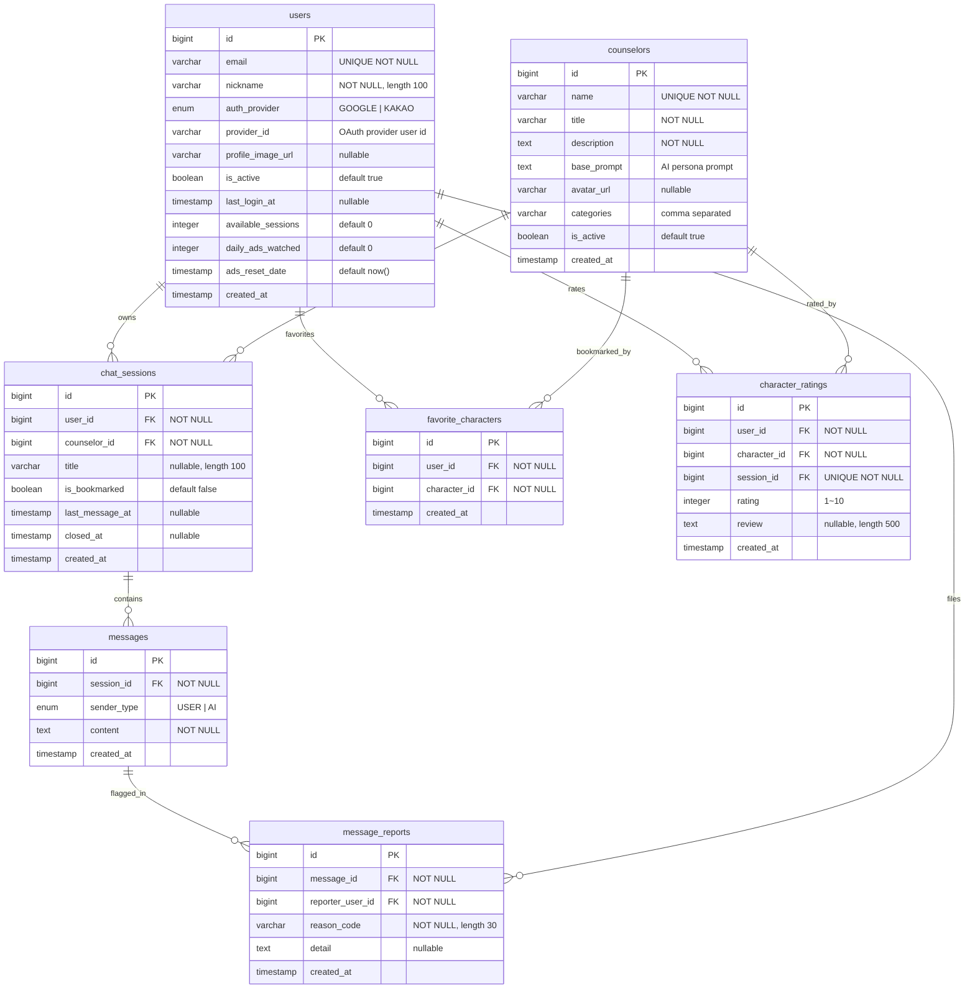

# ERD (Entity Relationship Diagram)

## 데이터베이스 스키마 개요



> **Note**: Kotlin 도메인에서는 AI 상담사를 `Character`로 다루지만, 기존 데이터 및 마이그레이션 비용을 고려해 테이블 이름은 `counselors`를 유지한다.

## 테이블 설명

### users
- OAuth 기반 사용자 계정 정보를 저장한다.
- `auth_provider`는 현재 Google 또는 Kakao만 허용한다.
- `available_sessions`, `daily_ads_watched`, `ads_reset_date`는 향후 보상 정책/광고 모델을 위한 필드다.

### counselors (Character 엔티티)
- Kotlin 도메인에서는 `Character`로 명명되지만, 하위 호환을 위해 테이블 이름은 `counselors`를 유지한다.
- `base_prompt`는 Spring AI 호출 시 캐릭터 페르소나로 주입되는 시스템 프롬프트다.
- `categories`는 프론트엔드 필터에 쓰이는 태그 목록을 콤마로 저장한다.

### chat_sessions
- 사용자와 상담사 간의 대화 세션을 나타낸다.
- `last_message_at`은 세션 목록 정렬에 사용되며 메시지 저장 시 갱신된다.
- `closed_at`이 null이면 진행 중, 값이 존재하면 종료된 세션이다.

### messages
- 사용자와 AI 캐릭터의 모든 메시지를 동일 테이블에 저장한다.
- `sender_type`으로 발신 주체(USER/AI)를 구분한다.
- 상담 단계(phase)는 제거되었고, 맥락 관리는 요약 프롬프트와 품질 정책으로 처리한다.
- `created_at`은 세션 타임라인 및 정렬 기준으로 사용된다.

### favorite_characters
- 사용자와 캐릭터 간 즐겨찾기 관계를 관리한다.
- `user_id`, `character_id` 조합에 유니크 제약이 걸린다.

### character_ratings
- 세션 종료 후 사용자가 남기는 캐릭터 평가와 리뷰를 저장한다.
- `session_id`는 유니크하여 세션당 하나의 평가만 허용된다.

### message_reports *(planned)*
- 신고 기능 도입을 위한 예정 테이블로, 메시지 단위 신고 이력을 단순히 저장한다.
- `message_id`는 신고 대상 메시지, `reporter_user_id`는 신고자 계정이다.
- `reason_code`는 미리 정의된 신고 사유(enum), `detail`은 선택 입력 메모다.

## 인덱스 전략
```sql
CREATE INDEX idx_users_provider ON users(provider_id, auth_provider);
CREATE INDEX idx_counselors_active ON counselors(is_active);
CREATE INDEX idx_sessions_user ON chat_sessions(user_id, last_message_at DESC);
CREATE INDEX idx_messages_session ON messages(session_id, created_at);
CREATE INDEX idx_favorite_characters_user ON favorite_characters(user_id);
CREATE INDEX idx_character_ratings_character ON character_ratings(character_id);
CREATE INDEX idx_message_reports_message ON message_reports(message_id);
```

## 스키마 관리 메모
- 모든 엔티티는 `BaseEntity`를 상속해 `created_at`을 자동 기록한다.
- 상담 단계 enum은 제거되었으며, 단계별 응답은 프롬프트/정책 로직으로 처리한다.
- 테스트 프로필에서는 H2 + `ddl-auto=create-drop`으로 스키마를 매 테스트 시드한다.
- 운영 환경은 Flyway 대신 JPA DDL로 관리하며, 구조 변경 시 마이그레이션 스크립트를 수동 적용한다.

## 향후 확장: 신고(Report) 도메인
- Google Play 정책 준수를 위해 `message_reports` 테이블과 신고 워크플로를 2025 Q4 안에 도입할 예정이다.
- 상단 ERD에 명세된 스키마는 설계안이며, 실제 배포 시 Flyway 마이그레이션과 엔티티 반영이 필요하다.
- 향후 운영 처리가 필요해지면 상태/담당자 컬럼을 확장하는 방향으로 진화시킬 수 있다.
