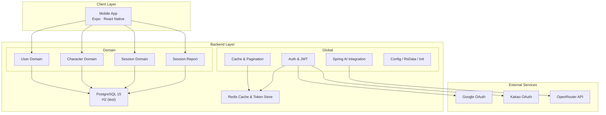
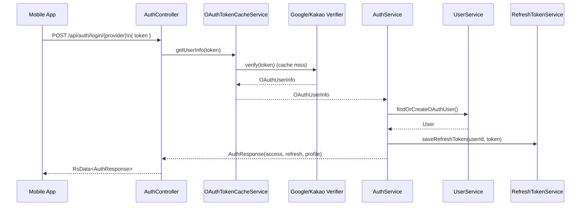
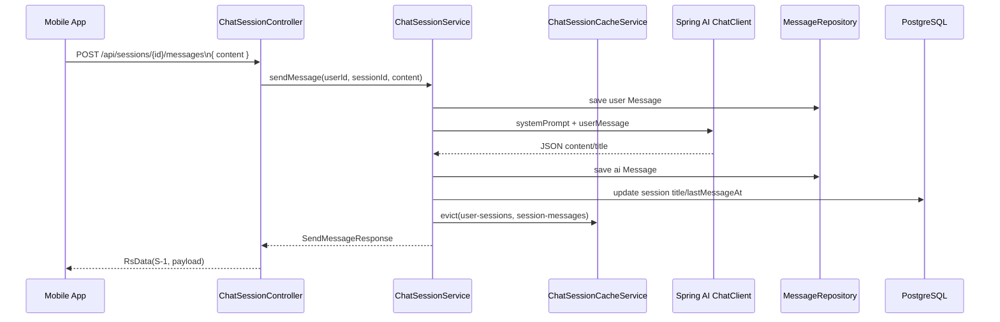
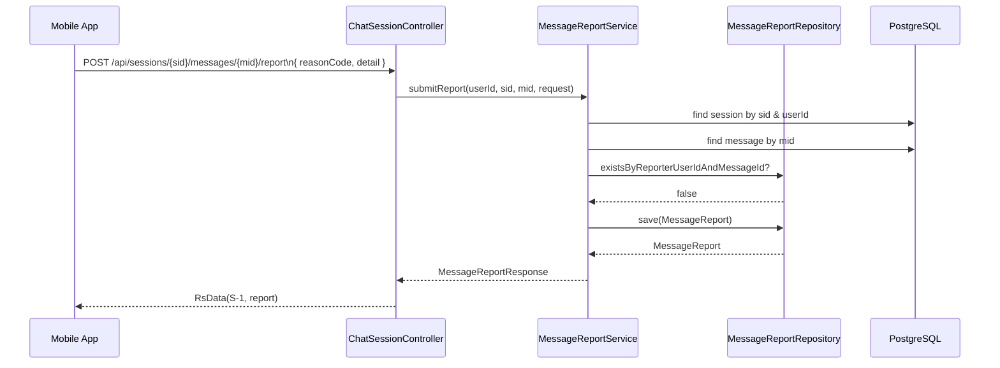

# 시스템 아키텍처

## 1. 전체 구성

- Expo 앱은 OAuth 로그인과 상담 UX를 담당한다.
- 백엔드는 Domain(사용자·캐릭터·세션/신고)와 Global(AI 연동, 캐시, 인증, 공통 모듈) 레이어로 구성된다.
- Redis는 캐시/토큰 저장소 역할을 하며, PostgreSQL이 영속 데이터를 저장한다.

## 2. 레이어 및 패키지 구조

### 2.1 Domain Layer
- `domain.character`: 캐릭터 목록·상세·즐겨찾기·평가 로직과 캐시된 조회를 담당한다.
- `domain.session`: 세션 생성/종료, 메시지 저장, AI 응답 처리, 북마크·제목·평가 기능을 제공한다.
- `domain.session.report`: 메시지 신고 도메인 (DTO·Entity·Service·Repository)으로 세션 소유 검증 및 중복 신고 방지 로직을 포함한다.
- `domain.user`: OAuth 기반 사용자 CRUD (프로필 조회, 닉네임 변경, 회원 탈퇴)를 처리한다.

### 2.2 Global Layer
- `global.auth`: `AuthController`, `AuthService`, `OAuthTokenCacheService`, `RefreshTokenService`, OAuth 검증기 구현을 포함한다.
- `global.config`: `SecurityConfig`, `CacheConfig`, `CorsConfig`, `JdslConfig`, `SwaggerConfig`, `WebClientConfig` 등 애플리케이션 설정을 관리한다.
- `global.security`: `JwtAuthenticationFilter`, `JwtTokenProvider`, `AuthProvider` enum을 통해 JWT 기반 인증을 적용한다.
- `global.pagination`: `CachedPage`, `PageUtils`, `PagedResponse`, `PageInfo`로 일관된 페이지 응답을 제공한다.
- `global.constants`, `global.rsData`, `global.rq`, `global.aspect`(ResponseAspect), `global.init`(InitDataConfig) 등 공통 유틸이 포함된다.
### 2.3 패키지 트리
```text
com.aicounseling.app
├── domain/
│   ├── character/{controller,dto,entity,repository,service}
│   ├── session/{controller,dto,entity,repository,service,report/**}
│   └── user/{controller,dto,entity,repository,service}
├── global/
│   ├── auth/{controller,dto,handler,service}
│   ├── config/{CacheConfig,CorsConfig,JdslConfig,SecurityConfig,SwaggerConfig,WebClientConfig}
│   ├── constants/AppConstants.kt
│   ├── pagination/{CachedPage.kt,PageUtils.kt}
│   ├── rq/Rq.kt
│   ├── rsData/RsData.kt
│   ├── security/{JwtAuthenticationFilter.kt,JwtTokenProvider.kt,AuthProvider.kt}
│   ├── aspect/ResponseAspect.kt
│   └── init/InitDataConfig.kt
└── AiCounselingApplication.kt
```
## 3. 핵심 컴포넌트

### 3.1 인증 및 보안
- `AuthService`는 Google/Kakao 토큰을 검증하고 사용자 정보를 생성·갱신한다.
- `OAuthTokenCacheService`는 검증 결과를 Redis에 캐싱해 반복 로그인 시 외부 API 호출을 줄인다.
- `RefreshTokenService`는 사용자별 Refresh 토큰을 Redis Set으로 저장하고 회전/폐기 로직을 제공한다.
- `SecurityConfig` + `JwtAuthenticationFilter`는 `/api/auth/**`, `/swagger-ui/**`, `/api/characters` GET을 제외한 모든 `/api/**` 요청에 인증을 강제한다.

### 3.2 캐릭터 & 세션
- `CharacterCacheService`와 `ChatSessionCacheService`는 Redis 캐시로 목록/상세 조회 성능을 높인다.
- `ChatSessionService`는 Spring AI `ChatClient`로 OpenRouter에 JSON 응답을 요청하고, 실패 시 fallback 메시지를 저장한다.
- `ChatSessionRepositoryImpl`은 Kotlin JDSL을 사용해 세션·캐릭터를 한 번에 조회, N+1 문제를 해소한다.

### 3.3 메시지 신고
- `MessageReportService`는 세션 소유자 검증, 신고 중복 체크, 사유 코드 Enum 변환을 처리한다.
- `MessageReport` 엔티티는 `message_reports` 테이블에 저장되며, 신고자 ID와 상세 사유를 기록한다.
- 신고가 성공하면 `MessageReportResponse`가 세션/메시지 ID와 생성 시각을 반환한다.

### 3.4 데이터 접근 및 캐싱
- `CachedPage`와 `PagedResponse`는 캐시에서 PageImpl을 직렬화/역직렬화하기 위한 래퍼를 제공한다.
- `CacheConfig`는 캐시 TTL을 캐시별로 분리 (`character:list`, `session-messages`, `oauth:*`, `refresh-token:*`)하고 JSON 직렬화를 위한 `GenericJackson2JsonRedisSerializer`를 구성한다.

## 4. 요청 흐름

### 4.1 OAuth 로그인

### 4.2 상담 메시지 처리

### 4.3 메시지 신고

## 5. 데이터 흐름 & 저장소
- PostgreSQL은 사용자, 캐릭터, 세션, 메시지, 즐겨찾기, 평가, 신고 데이터를 관리한다.
- Redis는 캐릭터/세션 페이지 캐시(`character:list`, `character:detail`, `user-sessions`, `session-messages`), OAuth 검증 캐시(`oauth:google-token`, `oauth:kakao-token`), Refresh 토큰(`refresh-token:*`)을 저장한다.
- 메시지 신고는 `message_reports` 테이블에 기록되어 향후 컨텐츠 모더레이션에 활용된다.

## 6. 배포 및 환경
| 구분 | 환경 | 주요 설정 |
|------|------|-----------|
| 개발 | `spring.profiles.active=dev` | H2 in-memory, ResponseAspect 비활성, Swagger UI 상시 노출 |
| 테스트 | `test` | H2 + JUnit5, MockK, `@Transactional` 롤백 |
| 운영 | Railway | PostgreSQL 15, Redis 캐시, ResponseAspect로 HTTP Status 매핑, `.env` 기반 비밀값, Actuator health 체크 |

CI/CD는 GitHub Actions (`.github/workflows/ci.yml`, `pr-check.yml`)에서 `./gradlew check-all`과 Expo EAS 빌드를 실행한다.

## 7. 보안·관측·성능 고려사항
- JWT는 `Authorization` 헤더에 전달되며 Refresh 토큰은 바디 파라미터로만 취급한다.
- `JwtAuthenticationFilter`는 토큰 검증 실패 시 통일된 RsData 포맷으로 401/403 응답을 생성한다.
- `CacheConfig`는 Redis 미설정 시 메모리 캐시로 자동 폴백한다.
- 로그 레벨은 `com.aicounseling` DEBUG, 기타 패키지 INFO 이상으로 설정해 문제 상황을 추적한다.
- Actuator, SpringDoc, 헬스체크 엔드포인트는 무인증으로 개방한다.

## 8. 확장 계획
- Redis 캐시 지표(히트율, 용량) 모니터링 및 캐시 warming 스크립트 도입.
- 세션 검색/요약을 위한 벡터 스토리지 연동 (Supabase Vector, Pinecone 등) 검토.
- Expo 앱에서 푸시 알림, 인앱 결제(프리미엄 캐릭터)를 지원하기 위한 백엔드 API 확장.
- OpenRouter 외 대체 모델(Spring AI adapters) 실험과 비용 최적화.
