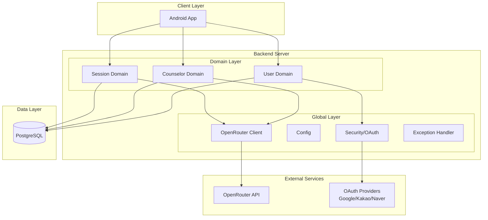
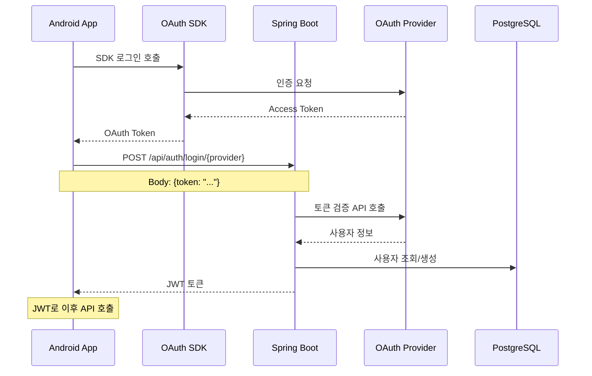
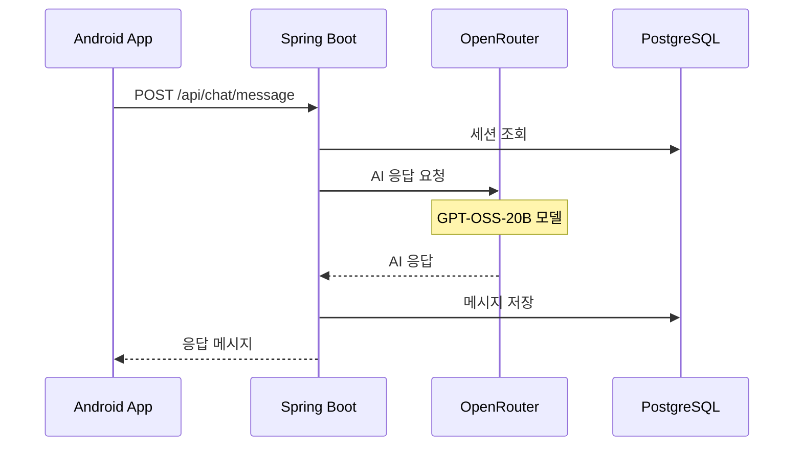

# 시스템 아키텍처

## 1. 아키텍처 개요



## 2. DDD(Domain-Driven Design) 패키지 구조

```
com.aicounseling.app/
├── domain/                    # 비즈니스 도메인
│   ├── user/                 # 사용자 도메인
│   │   ├── entity/
│   │   │   └── User.kt
│   │   ├── service/
│   │   │   └── UserService.kt
│   │   ├── repository/
│   │   │   └── UserRepository.kt
│   │   ├── controller/
│   │   │   └── UserController.kt
│   │   └── dto/
│   │
│   ├── counselor/           # 상담사 도메인
│   │   ├── entity/
│   │   │   ├── Counselor.kt
│   │   │   ├── CounselorRating.kt
│   │   │   └── FavoriteCounselor.kt
│   │   ├── service/
│   │   ├── repository/
│   │   ├── controller/
│   │   └── dto/
│   │
│   └── session/            # 세션 도메인
│       ├── entity/
│       │   ├── ChatSession.kt
│       │   ├── Message.kt
│       │   └── CounselingPhase.kt
│       ├── service/
│       ├── repository/
│       ├── controller/
│       └── dto/
│
└── global/                  # 공통 관심사
    ├── auth/               # OAuth 인증
    │   ├── controller/
    │   │   └── AuthController.kt
    │   ├── service/
    │   │   ├── AuthService.kt
    │   │   └── OAuthTokenVerifier.kt
    │   └── dto/
    ├── config/             # Spring 설정
    ├── security/           # JWT, 필터
    ├── exception/          # 전역 예외 처리
    ├── openrouter/         # OpenRouter API
    ├── entity/             # BaseEntity
    ├── rsData/             # 응답 포맷
    ├── rq/                 # Request Context
    ├── aspect/             # AOP
    ├── pagination/         # 페이지네이션
    └── constants/          # 상수
```

## 3. 핵심 컴포넌트

### 3.1 Domain Entities
- **User**: OAuth 사용자 정보 (BaseEntity 상속)
- **Counselor**: AI 상담사 정보 + base_prompt
- **ChatSession**: 상담 세션 (제목, 북마크)
- **Message**: 개별 메시지 + 상담 단계
- **CounselorRating**: 세션 평가 (1-10점)
- **FavoriteCounselor**: 즐겨찾기 매핑

### 3.2 Service Layer
```kotlin
// UserService - OAuth 로그인 처리
@Service
@Transactional
class UserService(
    private val userRepository: UserRepository
) {
    fun processOAuthLogin(
        email: String, 
        nickname: String, 
        provider: AuthProvider
    ): User {
        // 기존 사용자 확인 또는 신규 생성
        return userRepository.findByEmailAndAuthProvider(email, provider)
            ?: createNewUser(email, nickname, provider)
    }
}

// CounselorService - 상담사 관리
@Service
class CounselorService(
    private val counselorRepository: CounselorRepository,
    private val sessionRepository: ChatSessionRepository
) {
    fun findActiveCounselors(): List<Counselor> {
        return counselorRepository.findByIsActiveTrue()
    }
    
    fun getCounselorWithStats(id: Long): Counselor {
        val counselor = counselorRepository.findById(id)
        counselor.totalSessions = sessionRepository.countByCounselorId(id)
        return counselor
    }
}
```

### 3.3 OpenRouter Integration
```kotlin
@Service
class OpenRouterService(
    private val webClient: WebClient,
    private val properties: OpenRouterProperties
) {
    suspend fun sendCounselingMessage(
        userMessage: String,
        counselorPrompt: String,
        conversationHistory: List<Message>
    ): String {
        val request = ChatRequest(
            model = "meta-llama/llama-3.2-3b-instruct",
            messages = buildMessages(counselorPrompt, conversationHistory, userMessage),
            temperature = 0.7,
            max_tokens = 2000
        )
        
        return webClient.post()
            .uri("/chat/completions")
            .bodyValue(request)
            .retrieve()
            .bodyToMono(ChatResponse::class.java)
            .map { it.choices.first().message.content }
            .awaitSingle()
    }
}
```

## 4. 데이터 흐름

### 4.1 OAuth 로그인 플로우 (Android SDK 방식)


### 4.2 상담 메시지 처리


## 5. 상담 단계 (AI 자동 판단)

### 5.1 단계 정의
```kotlin
enum class CounselingPhase(
    val koreanName: String,
    val description: String
) {
    ENGAGEMENT(      // 관계 형성 - 신뢰 구축
        "관계 형성",
        "첨 인사, 관계 형성, 목표 설정 중일 때"
    ),
    EXPLORATION(     // 문제 탐색 - 구체적 경험
        "문제 탐색",
        "문제 상황, 감정, 구체적 경험을 탐색할 때"
    ),
    INSIGHT(         // 통찰 유도 - 패턴 발견
        "통찰 유도",
        "패턴 발견, 새로운 관점 제시, 깊은 성찰을 유도할 때"
    ),
    ACTION(          // 행동 계획 - 실천 방법
        "행동 계획",
        "실천 가능한 작은 변화, 구체적 행동 계획을 세울 때"
    ),
    CLOSING(         // 마무리 - 정리
        "마무리",
        "오늘 대화 정리, 긍정적 마무리, 다음 만남을 기대할 때"
    )
}
```

### 5.2 AI 자율 진행 규칙
- 메시지 수 기반 최소 단계 보장
- 이전 단계로 회귀 방지
- 선택 가능한 단계 중 선택
- 코드블록 없는 순수 JSON 응답

## 6. 데이터베이스 스키마

### 6.1 주요 테이블
```sql
-- users 테이블
CREATE TABLE users (
    id BIGSERIAL PRIMARY KEY,
    email VARCHAR(255) UNIQUE NOT NULL,
    nickname VARCHAR(100) NOT NULL,
    auth_provider VARCHAR(20) NOT NULL,
    provider_id VARCHAR(255),
    last_login_at TIMESTAMP,
    is_active BOOLEAN DEFAULT true,
    created_at TIMESTAMP DEFAULT CURRENT_TIMESTAMP
);

-- counselors 테이블
CREATE TABLE counselors (
    id BIGSERIAL PRIMARY KEY,
    name VARCHAR(50) UNIQUE NOT NULL,
    title VARCHAR(100) NOT NULL,
    description TEXT NOT NULL,
    base_prompt TEXT NOT NULL,
    avatar_url VARCHAR(500),
    is_active BOOLEAN DEFAULT true,
    created_at TIMESTAMP DEFAULT CURRENT_TIMESTAMP,
    updated_at TIMESTAMP DEFAULT CURRENT_TIMESTAMP
);

-- chat_sessions 테이블
CREATE TABLE chat_sessions (
    id BIGSERIAL PRIMARY KEY,
    user_id BIGINT REFERENCES users(id) NOT NULL,
    counselor_id BIGINT REFERENCES counselors(id) NOT NULL,
    title VARCHAR(100),
    is_bookmarked BOOLEAN DEFAULT false,
    last_message_at TIMESTAMP,
    created_at TIMESTAMP DEFAULT CURRENT_TIMESTAMP,
    updated_at TIMESTAMP DEFAULT CURRENT_TIMESTAMP,
    closed_at TIMESTAMP
);
```

## 7. API 엔드포인트

### 7.1 인증 API
```http
POST /api/auth/login/google   # Google 토큰 검증 + JWT 발급
POST /api/auth/login/kakao    # Kakao 토큰 검증 + JWT 발급  
POST /api/auth/login/naver    # Naver 토큰 검증 + JWT 발급
POST /api/auth/refresh         # JWT 토큰 갱신
```

### 7.2 사용자 API
```http
GET /api/users/me              # 내 정보 조회
PATCH /api/users/nickname      # 닉네임 변경
DELETE /api/users/me           # 회원 탈퇴
```

### 7.3 상담사 API
```http
GET /api/counselors                     # 상담사 목록 (페이지네이션)
GET /api/counselors/{id}                # 상담사 상세
GET /api/counselors/favorites           # 즐겨찾기 목록 (페이지네이션)
POST /api/counselors/{id}/favorite      # 즐겨찾기 추가
DELETE /api/counselors/{id}/favorite    # 즐겨찾기 제거
```

### 7.4 세션 API
```http
GET /api/sessions                        # 내 세션 목록 조회 (페이지네이션)
POST /api/sessions                       # 새 세션 시작
POST /api/sessions/{id}/close            # 세션 종료
GET /api/sessions/{id}/messages          # 메시지 목록 조회 (페이지네이션)
POST /api/sessions/{id}/messages         # 메시지 전송
POST /api/sessions/{id}/rating           # 세션 평가
POST /api/sessions/{id}/bookmark         # 북마크 토글
PATCH /api/sessions/{id}/title           # 세션 제목 변경
```

## 8. 배포 아키텍처

### 8.1 개발 환경
```
Android Studio (에뮬레이터)
    ↓
localhost:8080 (Spring Boot)
    ↓
H2 In-Memory DB
```

### 8.2 운영 환경
```
Android App (Play Store)
    ↓
Railway/Render (Spring Boot)
    ↓
Supabase (PostgreSQL)
```

## 9. 보안

### 9.1 인증/인가
- OAuth2 소셜 로그인만 지원
- JWT 토큰 기반 인증
- Spring Security 설정

### 9.2 API 보안
- HTTPS 필수
- API Key 환경변수 관리
- Rate Limiting (추후)

## 10. 성능 최적화

### 10.1 현재 적용
- Spring WebFlux 비동기
- Kotlin Coroutines
- JPA 지연 로딩

### 10.2 추후 적용
- Redis 캐싱
- 응답 압축
- CDN (이미지/정적 파일)

## 11. 모니터링 (추후)

### 11.1 APM
- Spring Actuator
- Prometheus + Grafana

### 11.2 로깅
- Logback
- ELK Stack (추후)

## 12. 확장 계획

### Phase 1 - MVP (완료 - 2025년 1월)
- OAuth 2.0 소셜 로그인 (Google, Kakao, Naver)
- JWT 기반 인증 시스템
- 상담사 목록 조회 및 상세 정보
- AI와 실시간 대화 (5단계 상담 프로세스)
- 세션 북마크 및 제목 관리
- 세션 평가 시스템
- 즐겨찾기 상담사 관리
- 103개 테스트 통과 (100% 성공률)

### Phase 2 (개발 예정)
- 대화 내용 검색
- 세션 요약 기능
- 상담 통계 대시보드
- 프리미엄 상담사

### Phase 3 (장기 계획)
- 실시간 알림 (WebSocket)
- 음성 상담 기능
- 그룹 상담 세션
- AI 감정 분석
