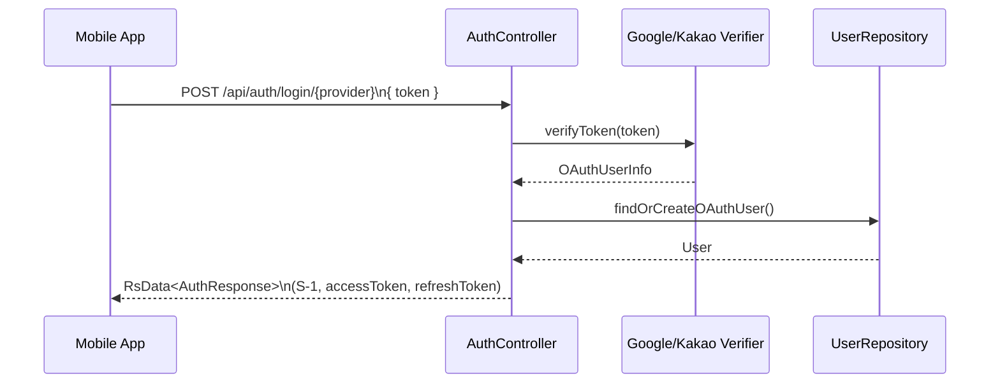
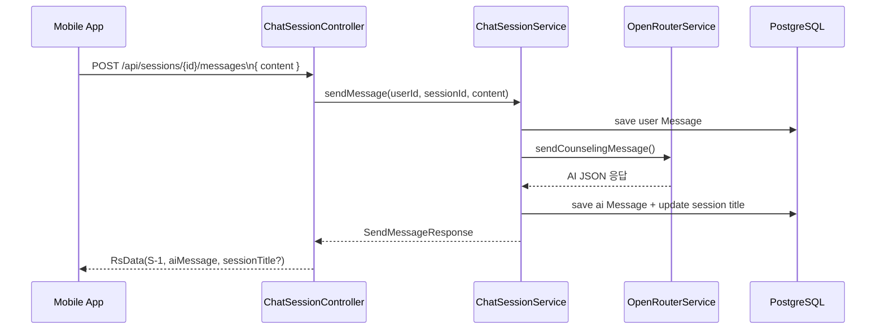

# 시스템 아키텍처

## 1. 전체 구성
```mermaid
graph TB
    subgraph Client Layer
        APP[Mobile App\n(Expo / React Native)]
    end

    subgraph Backend Layer
        subgraph Domain
            USER[User Domain]
            COUN[Counselor Domain]
            SESS[Session Domain]
        end
        subgraph Global
            AUTH[Auth & Security]
            AI[OpenRouter Integration]
            INIT[Config & Init]
            ERR[Exception / RsData]
        end
        DB[(PostgreSQL 15\nH2 (test))]
    end

    subgraph External Services
        GOOGLE[(Google OAuth)]
        KAKAO[(Kakao OAuth)]
        OPENROUTER[(OpenRouter API)]
    end

    APP --> USER
    APP --> COUN
    APP --> SESS

    AUTH --> GOOGLE
    AUTH --> KAKAO
    AI --> OPENROUTER

    USER --> DB
    COUN --> DB
    SESS --> DB
```

- 클라이언트는 Expo/React Native 앱으로 OAuth 로그인과 상담 UX를 제공한다.
- 백엔드는 Domain(사용자·상담사·세션)과 Global(인증, 공통 설정, AI 연동) 레이어로 구성된다.
- 외부 서비스는 Google/Kakao OAuth 및 OpenRouter Chat API만 사용한다.

## 2. 레이어 및 패키지 구조

### 2.1 Domain Layer
- `domain.user`: 프로필 조회, 닉네임 변경, 회원 탈퇴 로직을 제공한다.
- `domain.counselor`: 상담사 목록·상세·즐겨찾기·평가를 담당하고 Kotlin JDSL로 통계 쿼리를 수행한다.
- `domain.session`: 세션 생성/종료, 메시지 기록, 북마크·제목·평가 처리와 AI 연동을 맡는다.

### 2.2 Global Layer
- `global.auth`: `AuthController`, `AuthService`, Google/Kakao 토큰 검증기, `JwtTokenProvider`를 포함한다.
- `global.security`: JWT 필터, Spring Security 설정, CORS 정책을 정의한다.
- `global.openrouter`: WebClient 설정(`OpenRouterConfig`)과 AI 호출(`OpenRouterService`).
- `global.pagination`, `global.rsData`, `global.constants`, `global.aspect`(prod 전용 ResponseAspect), `global.rq` 등 공통 유틸을 제공한다.
- `global.init`: `InitDataConfig`가 초기 상담사/테스트 데이터를 시드한다.

### 2.3 공통 설정 및 라이브러리
- Spring Boot 3.5.4, JPA + Kotlin JDSL, WebFlux WebClient, Kotlin Coroutines를 사용한다.
- `PageUtils`와 `PagedResponse`가 일관된 페이지 응답을 만든다.
- ktlint, detekt를 통해 코딩 규칙과 정적 분석을 enforcing 한다.

#### 패키지 트리
```text
com.aicounseling.app
├── domain/
│   ├── counselor/{controller,dto,entity,repository,service}
│   ├── session/{controller,dto,entity,repository,service}
│   └── user/{controller,dto,entity,repository,service}
├── global/
│   ├── auth/{controller,dto,service}
│   ├── config/, security/, constants/, pagination/, rsData/
│   ├── openrouter/{OpenRouterConfig.kt, OpenRouterService.kt}
│   ├── init/InitDataConfig.kt
│   └── aspect/ResponseAspect.kt (prod 전용)
└── AiCounselingApplication.kt
```

## 3. 핵심 컴포넌트

### 3.1 인증/보안
- `AuthController`가 `/api/auth/login/{provider}`와 `/api/auth/refresh` 엔드포인트를 노출한다.
- `AuthService`는 Google/Kakao 토큰을 검증하고 `JwtTokenProvider`로 Access/Refresh 토큰을 발급한다.
- `SecurityConfig`는 JWT 필터, CORS, 비로그인 허용 경로(`/api/auth/**`, `/swagger-ui/**` 등)를 정의한다.

### 3.2 세션 & AI
- `ChatSessionService`는 세션 생성·종료, 메시지 저장, 상담 단계 결정, AI 응답 파싱을 담당한다.
- `OpenRouterService`는 WebClient로 `openrouter/sonoma-sky-alpha`(기본) 모델을 호출하고 60초 타임아웃·3회 재시도를 적용한다.
- `AppConstants.Session`은 상담 단계 임계치, 기본 제목, 시스템 프롬프트 템플릿을 관리한다.

### 3.3 데이터 접근
- JPA와 Kotlin JDSL을 사용해 통계 및 정렬 쿼리를 구현한다 (`CounselorRepository.findCounselorsWithStats` 등).
- 모든 엔티티는 `BaseEntity`를 상속해 `id`, `createdAt`, `updatedAt`을 공통 관리한다.
- `PagedResponse`는 Spring `Page` 결과를 content + pageInfo 형태로 직렬화한다.

## 4. 요청 흐름

### 4.1 OAuth 로그인


### 4.2 상담 메시지 처리


## 5. 데이터 흐름 및 저장소
- 사용자 한 명은 여러 세션을 가질 수 있으며, 세션마다 다수 메시지를 가진다.
- 즐겨찾기(`favorite_counselors`)와 평점(`counselor_ratings`)은 사용자-상담사 관계를 위한 별도 테이블이다.
- `lastMessageAt`는 메시지 저장 시 업데이트되어 세션 목록 정렬에 사용된다.
- 평가 데이터는 세션당 1회만 허용하며, 중복 요청은 서비스 레벨에서 차단된다.

## 6. 배포 및 환경

| 구분 | 환경 | 주요 설정 |
|------|------|-----------|
| 개발 | `spring.profiles.active=dev` | H2 in-memory, ResponseAspect 비활성, Swagger UI 노출 |
| 테스트 | `test` | H2 + JUnit5, MockK 기반 통합 테스트, `@Transactional` 롤백 |
| 운영 | Railway | PostgreSQL 15, ResponseAspect로 HTTP Status 매핑, `.env` 기반 비밀값, Actuator health 체크 |

CI/CD는 GitHub Actions 워크플로(`.github/workflows/ci.yml`, `pr-check.yml`)에서 `./gradlew check-all`과 Expo EAS 빌드를 실행한다.

## 7. 보안·관측·성능 고려사항
- JWT는 `Authorization` 헤더로 전달되며 Refresh 토큰은 바디 파라미터로만 처리한다.
- `OpenRouterService` 오류는 WARN 로그와 함께 사용자에게 재시도 메시지를 반환하며, 타임아웃 시 사용자 메시지를 롤백한다.
- 로그 레벨은 `com.aicounseling` DEBUG, 웹/보안 패키지는 INFO 이상으로 설정돼 문제 상황을 추적한다.
- 초기 데이터 시드는 운영 환경에서도 상담사 seed만 생성하도록 try/catch로 감싸져 있다.

## 8. 확장 계획
- Redis 캐시로 상담사 목록과 세션 메타데이터를 캐싱할 예정이며, Railway의 Redis 애드온 도입을 검토 중이다.
- 대화 검색·요약 기능을 위해 벡터 스토리지(예: Supabase Vector, Pinecone) 연동을 검토하고 있다.
- Expo 앱에서 푸시 알림, 인앱 결제(프리미엄 상담사)를 지원할 수 있도록 관련 백엔드 엔드포인트를 추가할 계획이다.
