# 유스케이스 다이어그램

## AI 상담 시스템 Use Case Diagram

```mermaid
graph TB
    UserActor["사용자"]
    OAuthProvider["OAuth Providers<br/>Google · Kakao"]
    AiService["OpenRouter AI"]

    subgraph System["AI 상담 시스템 (Spring Boot + Kotlin)"]
        UC1["OAuth 로그인"]
        UC2["JWT 토큰 발급"]
        UC3["토큰 갱신"]
        UC4["프로필 조회"]
        UC5["닉네임 변경"]
        UC6["회원 탈퇴"]
        UC7["캐릭터 목록"]
        UC8["캐릭터 상세"]
        UC9["즐겨찾기 관리"]
        UC10["즐겨찾기 목록"]
        UC11["새 세션 시작"]
        UC12["세션 목록 조회"]
        UC13["세션 종료"]
        UC14["세션 북마크 토글"]
        UC15["세션 제목 수정"]
        UC16["메시지 전송"]
        UC17["AI 응답 생성"]
        UC18["메시지 목록 조회"]
        UC19["세션 평가"]
        UC20["메시지 신고"]
    end

    UserActor --> UC1
    UserActor --> UC3
    UserActor --> UC4
    UserActor --> UC5
    UserActor --> UC6
    UserActor --> UC7
    UserActor --> UC8
    UserActor --> UC9
    UserActor --> UC10
    UserActor --> UC11
    UserActor --> UC12
    UserActor --> UC13
    UserActor --> UC14
    UserActor --> UC15
    UserActor --> UC16
    UserActor --> UC18
    UserActor --> UC19
    UserActor --> UC20

    OAuthProvider --> UC1
    OAuthProvider --> UC2

    AiService --> UC17

    UC1 -->|include| UC2
    UC11 -->|include| UC7
    UC16 -->|include| UC17
    UC13 -->|include| UC19
    UC16 -->|include| UC18
    UC16 -->|include| UC20
```

## 유스케이스 상세

### 🔐 인증 시스템
| Use Case | 설명 | 상태 |
|----------|------|------|
| OAuth 로그인 | Google, Kakao 소셜 로그인 | ✅ 완료 |
| JWT 토큰 발급 | Access & Refresh 토큰 발급 | ✅ 완료 |
| 토큰 갱신 | Refresh 토큰 회전 및 재발급 | ✅ 완료 |
| 프로필 조회 | `/api/users/me` | ✅ 완료 |
| 닉네임 변경 | `/api/users/nickname` | ✅ 완료 |
| 회원 탈퇴 | `/api/users/me` DELETE | ✅ 완료 |

### 🧑‍🏫 캐릭터 관리
| Use Case | 설명 | 상태 |
|----------|------|------|
| 캐릭터 목록 | 정렬/페이징 지원 (`sort`, `page`, `size`) | ✅ 완료 |
| 캐릭터 상세 | 평균 평점·세션 수·총 평가 수 포함 | ✅ 완료 |
| 즐겨찾기 관리 | POST/DELETE `/characters/{id}/favorite` | ✅ 완료 |
| 즐겨찾기 목록 | `/api/characters/favorites` | ✅ 완료 |

### 💬 상담 세션
| Use Case | 설명 | 상태 |
|----------|------|------|
| 세션 시작 | `/api/sessions` POST | ✅ 완료 |
| 세션 목록 | 북마크·종료 상태 필터 지원 | ✅ 완료 |
| 세션 종료 | `/api/sessions/{id}` DELETE | ✅ 완료 |
| 세션 북마크 | `/api/sessions/{id}/bookmark` PATCH | ✅ 완료 |
| 제목 수정 | `/api/sessions/{id}/title` PATCH | ✅ 완료 |

### 🗨️ 메시지 및 AI
| Use Case | 설명 | 상태 |
|----------|------|------|
| 메시지 전송 | 사용자 메시지 저장 + 캐시 무효화 | ✅ 완료 |
| AI 응답 생성 | Spring AI ChatClient + OpenRouter 연동 | ✅ 완료 |
| 메시지 목록 | 생성 시간 ASC 페이징 (`PageUtils`) | ✅ 완료 |
| 세션 평가 | `/api/sessions/{id}/rate` 1~10 평점 | ✅ 완료 |
| 메시지 신고 | `/api/sessions/{sid}/messages/{mid}/report` | ✅ 완료 |

### 🛠️ 운영 & 캐싱
| Use Case | 설명 | 상태 |
|----------|------|------|
| OAuth 토큰 캐시 | Redis TTL 60초로 벤더 호출 절감 | ✅ 완료 |
| Refresh 토큰 회전 | Redis Set으로 토큰 관리 및 폐기 | ✅ 완료 |
| 캐릭터/세션 캐싱 | `character:list`, `user-sessions` 캐시 활용 | ✅ 완료 |

## 향후 확장 유스케이스
| Use Case | 설명 | 상태 |
|----------|------|------|
| 세션 검색 | 키워드/벡터 기반 대화 검색 | 📝 예정 |
| 세션 요약 | AI 기반 대화 요약 | 📝 예정 |
| 캐릭터 추천 | 이용 패턴 기반 맞춤 추천 | 📝 예정 |
| 푸시 알림 | 세션 이벤트 알림 | 📝 예정 |

## 참고 사항
- 모든 API는 `RsData` 포맷으로 응답하며, 성공 시 `resultCode`는 `S-1`로 필터링한다.
- 캐릭터 목록·세션 목록·메시지 조회는 Redis 캐시 히트 시에도 동일한 응답 구조를 유지한다.
- ResponseAspect는 운영 프로필에서만 활성화되어 `RsData.resultCode`에 따라 HTTP Status를 조정한다.
- Expo 앱은 React Query로 캐시를 관리하며, 세션/메시지 변경 시 캐시 무효화를 위해 응답 데이터를 즉시 반영한다.
