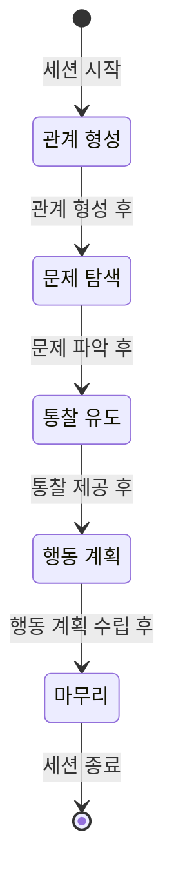

# 유스케이스 다이어그램

## AI 상담 시스템 Use Case Diagram

```mermaid
graph TB
    %% 스타일 정의
    classDef actor fill:#2196F3,stroke:#0D47A1,stroke-width:2px,color:#FFFFFF
    classDef usecase fill:#4CAF50,stroke:#2E7D32,stroke-width:2px,color:#FFFFFF
    classDef system fill:#9C27B0,stroke:#4A148C,stroke-width:3px,color:#FFFFFF
    
    %% 액터
    User[👤 사용자]:::actor
    OAuth[🔐 OAuth Provider]:::actor  
    AI[🤖 OpenRouter AI]:::actor
    
    %% 시스템 경계
    subgraph System[" AI 상담 시스템 (Spring Boot + Kotlin) "]
        %% 인증 관련 (구현 완료)
        UC1[OAuth 로그인<br/>Google/Kakao/Naver]:::usecase
        UC2[JWT 토큰 발급]:::usecase
        UC3[토큰 갱신]:::usecase
        UC4[프로필 조회]:::usecase
        UC5[닉네임 변경]:::usecase
        UC6[회원 탈퇴]:::usecase
        
        %% 상담사 관련 (구현 완료)
        UC7[상담사 목록 조회]:::usecase
        UC8[상담사 상세 정보]:::usecase
        UC9[즐겨찾기 추가/제거]:::usecase
        UC10[즐겨찾기 목록]:::usecase
        
        %% 세션 관련 (구현 완료)
        UC11[새 세션 시작]:::usecase
        UC12[세션 목록 조회]:::usecase
        UC13[세션 종료]:::usecase
        UC14[세션 북마크]:::usecase
        UC15[세션 제목 변경]:::usecase
        
        %% 대화 관련 (구현 완료)
        UC16[메시지 전송]:::usecase
        UC17[AI 응답 생성<br/>5단계 상담]:::usecase
        UC18[메시지 목록 조회]:::usecase
        UC19[상담 단계 자동 전환]:::usecase
        
        %% 평가 관련 (구현 완료)
        UC20[세션 평가<br/>1-10점]:::usecase
        UC21[피드백 작성]:::usecase
    end
    
    %% 사용자 연결
    User --> UC1
    User --> UC3
    User --> UC4
    User --> UC5
    User --> UC6
    User --> UC7
    User --> UC8
    User --> UC9
    User --> UC10
    User --> UC11
    User --> UC12
    User --> UC13
    User --> UC14
    User --> UC15
    User --> UC16
    User --> UC18
    User --> UC20
    User --> UC21
    
    %% OAuth Provider 연결
    OAuth --> UC1
    OAuth --> UC2
    
    %% AI 시스템 연결
    AI --> UC17
    AI --> UC19
    
    %% Include 관계
    UC1 -.include.-> UC2
    UC11 -.include.-> UC7
    UC16 -.include.-> UC17
    UC17 -.include.-> UC19
    UC13 -.include.-> UC20
    
    %% Extend 관계
    UC7 -.extend.-> UC8
    UC20 -.extend.-> UC21
    UC12 -.extend.-> UC14
    UC12 -.extend.-> UC15
```

## 주요 유스케이스 상세 설명

### 🔐 인증 시스템 (OAuth 2.0)
| Use Case | 설명 | 구현 상태 |
|----------|------|-----------|
| OAuth 로그인 | Google, Kakao, Naver 소셜 로그인 | ✅ 완료 |
| JWT 토큰 발급 | Access Token + Refresh Token | ✅ 완료 |
| 토큰 갱신 | Refresh Token으로 새 Access Token 발급 | ✅ 완료 |
| 프로필 조회 | 사용자 정보 조회 (GET /api/users/me) | ✅ 완료 |
| 닉네임 변경 | 사용자 닉네임 수정 | ✅ 완료 |
| 회원 탈퇴 | 계정 및 관련 데이터 삭제 | ✅ 완료 |

### 🧑‍💼 상담사 관리
| Use Case | 설명 | 구현 상태 |
|----------|------|-----------|
| 상담사 목록 | 페이지네이션된 상담사 리스트 | ✅ 완료 |
| 상담사 상세 | 개별 상담사 정보 및 통계 | ✅ 완료 |
| 즐겨찾기 관리 | 상담사 즐겨찾기 추가/제거 | ✅ 완료 |
| 즐겨찾기 목록 | 즐겨찾기한 상담사 조회 | ✅ 완료 |

### 💬 상담 세션
| Use Case | 설명 | 구현 상태 |
|----------|------|-----------|
| 세션 시작 | 선택한 상담사와 새 대화 시작 | ✅ 완료 |
| 세션 목록 | 내 상담 세션 목록 (북마크 필터) | ✅ 완료 |
| 세션 종료 | 진행 중인 세션 종료 | ✅ 완료 |
| 세션 북마크 | 중요 세션 북마크 토글 | ✅ 완료 |
| 제목 변경 | 세션 제목 수정 | ✅ 완료 |

### 🗨️ 대화 시스템
| Use Case | 설명 | 구현 상태 |
|----------|------|-----------|
| 메시지 전송 | 사용자 메시지 전송 | ✅ 완료 |
| AI 응답 | OpenRouter API로 AI 응답 생성 | ✅ 완료 |
| 메시지 조회 | 세션별 메시지 히스토리 | ✅ 완료 |
| 상담 단계 | 5단계 자동 전환 (AI 자율 판단) | ✅ 완료 |

### ⭐ 평가 시스템
| Use Case | 설명 | 구현 상태 |
|----------|------|-----------|
| 세션 평가 | 1-10점 평가 (별점 0.5-5.0) | ✅ 완료 |
| 피드백 작성 | 최대 500자 텍스트 피드백 | ✅ 완료 |

## 5단계 상담 프로세스

AI가 대화 맥락을 분석하여 자동으로 단계를 전환합니다:

## 기술 스택

- **Backend**: Spring Boot 3.5.4, Kotlin 1.9.25
- **Database**: PostgreSQL (운영), H2 (개발)
- **AI**: OpenRouter API (meta-llama/llama-3.2-3b-instruct)
- **인증**: OAuth 2.0 + JWT
- **아키텍처**: DDD (Domain-Driven Design)

## 액터(Actor) 설명

### 👤 사용자 (User)
- OAuth 로그인한 일반 사용자
- 상담사 선택, 대화, 평가 기능 사용

### 🔐 OAuth Provider
- Google, Kakao, Naver
- 사용자 인증 정보 제공

### 🤖 OpenRouter AI
- AI 상담사 응답 생성
- 5단계 상담 프로세스 자율 진행
- meta-llama/llama-3.2-3b-instruct 모델 사용

## 향후 개발 예정

### Phase 2
- 대화 내용 검색
- 세션 요약 기능
- 상담 통계 대시보드

### Phase 3
- 실시간 알림 (WebSocket)
- 음성 상담
- 그룹 상담 세션